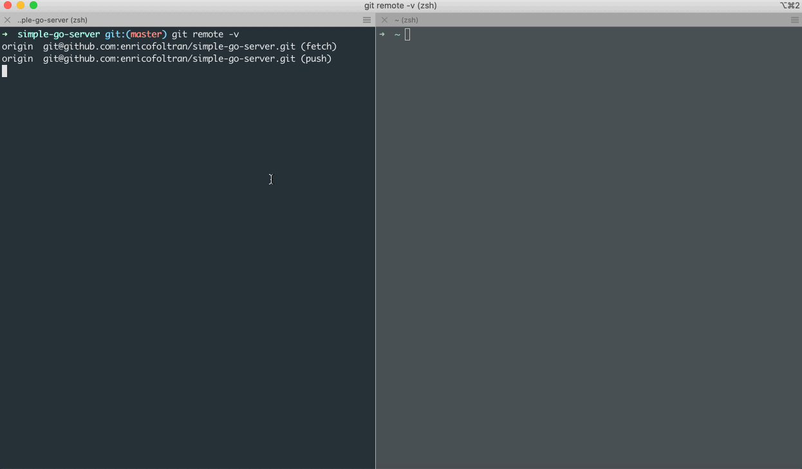
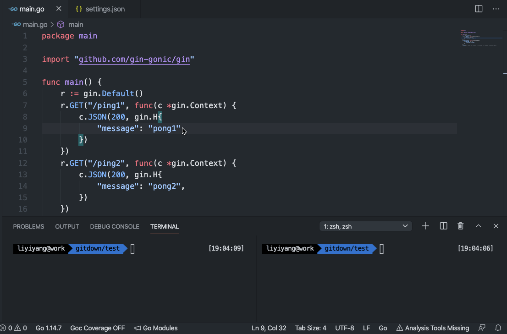

# goc
[](https://goreportcard.com/report/github.com/qiniu/goc)


[](https://codecov.io/gh/qiniu/goc)
[](https://godoc.org/github.com/qiniu/goc)

[中文页](README_zh.md) |

goc is a comprehensive coverage testing system for The Go Programming Language, especially for some complex scenarios, like system testing code coverage collection and
accurate testing.

Enjoy, Have Fun!


## Installation

Download the latest version from [Github Releases](https://github.com/qiniu/goc/releases) page.

Goc supports both `GOPATH` project and `Go Modules` project with **Go 1.11+**. However, for developing goc, you need to install **Go 1.13+**.

## Examples
You can use goc tool in many scenarios.

### Code Coverage Collection for Your Golang System Tests
Goc can collect code coverages at runtime for your long-run golang applications. To do that, normally just need three steps:

1. use `goc server` to start a service registry center:
    ```
    ➜  simple-go-server git:(master) ✗ goc server
    ```
2. use `goc build` to build the target service, and run the generated binary. Here let's take the [simple-go-server](https://github.com/CarlJi/simple-go-server) project as example:
    ```
    ➜  simple-go-server git:(master) ✗ goc build .
    ... // omit logs
    ➜  simple-go-server git:(master) ✗ ./simple-go-server  
    ```
3. use `goc profile` to get the code coverage profile of the started simple server above:
    ```
    ➜  simple-go-server git:(master) ✗ goc profile
    mode: atomic
    enricofoltran/simple-go-server/main.go:30.13,48.33 13 1
    enricofoltran/simple-go-server/main.go:48.33,50.3 1 0
    enricofoltran/simple-go-server/main.go:52.2,65.12 5 1
    enricofoltran/simple-go-server/main.go:65.12,74.46 7 1
    enricofoltran/simple-go-server/main.go:74.46,76.4 1 0
    ...   
    ```

### Show Code Coverage Change at Runtime in Vscode

We provide a vscode extension - [Goc Coverage](https://marketplace.visualstudio.com/items?itemName=lyyyuna.goc) which can show highlighted covered source code at runtime. 



## Tips

1. To understand the execution details of goc tool, you can use the `--debug` flag. Also we appreciate if you can provide such logs when submitting a bug to us.

2. By default, the covered service will listen a random port in order to communicate with the goc server. This may not be suitable in [docker](https://docs.docker.com/engine/reference/commandline/run/#publish-or-expose-port--p---expose) or [kubernetes](https://kubernetes.io/docs/concepts/services-networking/service/#defining-a-service) environment since the port must be exposed explicitly in order to be accessible by others in such environment. For this kind of scenario, you can use `--agentport` flag to specify a fixed port when calling `goc build` or `goc install`.

3. To use a remote goc server, you can use `--center` flag to compile the target service with `goc build` or `goc install` command.

4. The coverage data is stored on each covered service side, so if one service needs to restart during test, this service's coverage data will be lost. For this case, you can use following steps to handle:

    1. Before the service restarts, collect coverage with `goc profile -o a.cov`
    2. After service restarted and test finished, collect coverage again with `goc profile -o b.cov`
    3. Merge two coverage profiles together: `goc merge a.cov b.cov -o merge.cov`

## RoadMap
- [x] Support code coverage collection for system testing.
- [x] Support code coverage counters clear for the services under test at runtime.
- [x] Support develop mode towards accurate testing.
- [ ] Support code coverage diff based on Pull Request.
- [ ] Optimize the performance costed by code coverage counters.

## Contributing
We welcome all kinds of contribution, including bug reports, feature requests, documentation improvements, UI refinements, etc.

Thanks to all [contributors](https://github.com/qiniu/goc/graphs/contributors)!!

## License
Goc is released under the Apache 2.0 license. See [LICENSE.txt](https://github.com/qiniu/goc/blob/master/LICENSE)

## Join goc WeChat Group
